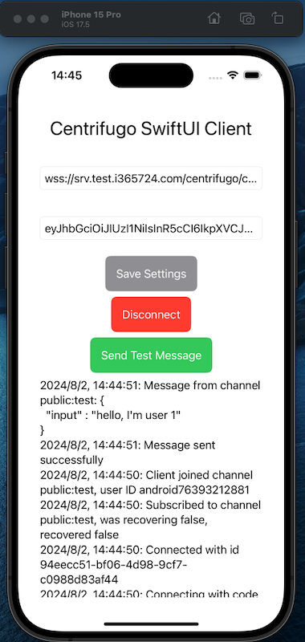

- [Centrifugo Sample](#centrifugo-sample)
  - [Features](#features)
  - [Getting Started](#getting-started)
  - [References](#references)
  - [Configuration](#configuration)
    - [Generate Config](#generate-config)
    - [Extra Settings](#extra-settings)
  - [Start Centrifugo Server](#start-centrifugo-server)
  - [Generate Token](#generate-token)
  - [Launch Web Client](#launch-web-client)
  - [Demo Web Client](#demo-web-client)
  - [How to launch iOS app](#how-to-launch-ios-app)
  - [Demo iOS Client](#demo-ios-client)


# Centrifugo Sample

Centrifugo Sample
A simple React app demonstrating real-time communication with Centrifugo using WebSockets. The app allows users to connect to a Centrifugo server, publish messages, and receive real-time updates with timestamps.

## Features
- Connect to a Centrifugo server using a WebSocket URL and token
Publish messages to a specified channel
- Receive and display real-time messages with timestamps
## Getting Started
- Generate and configure your Centrifugo server
- Launch the React client
- Send and receive real-time messages

## References
- [Centrifuge Java](https://github.com/centrifugal/centrifuge-java)  
- [centrifuge-swift](https://github.com/centrifugal/centrifuge-swift)
- [Client SDK API](https://centrifugal.dev/docs/transports/client_api)
## Configuration

### Generate Config
Run the following command to generate the initial configuration file:
```shell
centrifugo genconfig
```

### Extra Settings
Add the following line to your `config.json` to allow client subscriptions:
```json
"allow_subscribe_for_client": true
```

## Start Centrifugo Server
Start the Centrifugo server with the specified configuration and debug log level:
```shell
centrifugo --config=config.json --log_level=debug
```

## Generate Token
Generate a token for a user (e.g., `testuser`):
```shell
centrifugo gentoken -u testuser
```

## Launch Web Client
Navigate to the `centrifugo-web-client` directory, install dependencies, and start the client:
```shell
cd centrifugo-web-client
yarn install
yarn start
```

## Demo Web Client


## How to launch iOS app
- Open `iOS-client` in Xcode
- Add package dependencies "centrifuge-swift"
- Run the app on a simulator or device

## Demo iOS Client
